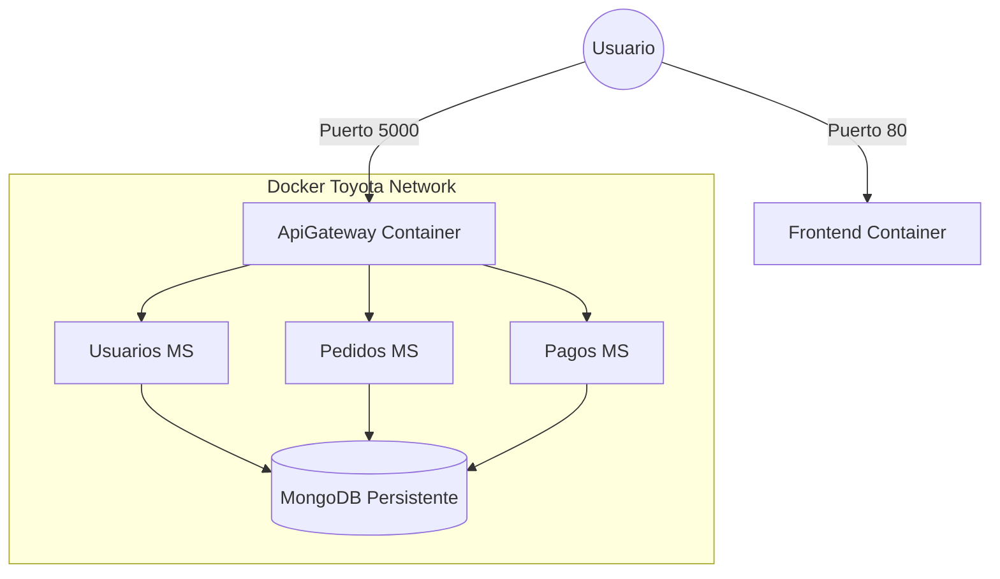

# 🚀 Proyecto Pedidos: Arquitectura Enterprise (Nivel Toyota)

[](https://github.com/alejandrochreyes2/proyecto-pedidos/actions)

Este proyecto ha evolucionado de un MVP básico a una **Arquitectura Enterprise de alto nivel (Nivel Toyota)**. Implementa un ecosistema de microservicios robusto, seguro y escalable utilizando las últimas tecnologías de .NET y Angular, todo orquestado con Docker de grado profesional.

---

## 🏗️ Arquitectura del Sistema

El sistema utiliza un patrón de **API Gateway** centralizado y contenedores optimizados.

### Componentes Principales:
1.  **Frontend (Angular 21)**: Modernizado con **Signals** y **Interceptores funcionales**. Se sirve vía Nginx en Docker.
2.  **API Gateway (YARP)**: Punto de entrada único (:5000) que gestiona el tráfico hacia los microservicios.
3.  **Microservicios (.NET 8)**:
    *   **Usuarios**: Gestión de identidad con **Identity** y JWT.
    *   **Pedidos**: Lógica de negocio con **Repository Pattern**.
    *   **Pagos**: Procesamiento de transacciones.
4.  **Base de Datos**: **MongoDB** profesional con volúmenes persistentes.
5.  **Red (Toyota-Network)**: Red interna privada para comunicación segura entre contenedores.

---

## 🛣️ Hoja de Ruta: La Evolución "Toyota"

### Fase 1: Seguridad Industrial
- Autenticación Real con Identity.
- JWT con Roles y Claims.

### Fase 2: Arquitectura Limpia
- Repository Pattern e Inyección de Dependencias.
- DTOs y AutoMapper.

### Fase 3: Gateway Hub
- YARP como Proxy Inverso.
- Centralización de CORS y Seguridad.

### Fase 4: Cloud & DevOps
- **Docker Full Stack**: Orquestación total con `docker-compose`.
- **CI/CD**: Sincronización automática con GitHub Actions.

---

## 📊 Diagrama de Infraestructura Docker



---

## 🚀 Cómo Ejecutar el Ecosistema Completo

### Con Docker Compose (Recomendado)
Desde la raíz del proyecto, ejecuta:
```bash
docker-compose up --build
```
Esto levantará los 6 servicios sincronizados: `frontend`, `apigateway`, `usuarios`, `pedidos`, `pagos` y `mongodb`.

### Puertos Disponibles:
- **Frontend**: [http://localhost](http://localhost)
- **API Gateway**: [http://localhost:5000](http://localhost:5000)
- **MongoDB**: [http://localhost:27017](http://localhost:27017)

---

## 📁 Estructura del Repositorio
```text
proyecto-pedidos/
├── docker-compose.yml      # Orquestación Maestra
├── backend/
│   ├── ApiGateway/         # Punto de entrada (YARP)
│   ├── usuarios/           # Identidad (.NET 8)
│   ├── pedidos/            # Negocio (.NET 8)
│   └── pagos/              # Transacciones (.NET 8)
├── frontend/               # Angular 21 + Signals
└── .github/workflows/      # CI/CD Automático
```

---

Desarrollado con ❤️ para alcanzar el **Nivel Toyota** en arquitectura de software. 🏁🚀

---

## 🚀 Deploy en Azure

### Prerequisitos
- Cuenta de Azure activa
- [Azure CLI](https://learn.microsoft.com/en-us/cli/azure/install-azure-cli) instalado
- Docker instalado localmente

### 1. Crear recursos en Azure

```bash
# Grupo de recursos
az group create --name toyota-pedidos-rg --location eastus

# Azure Container Registry (ACR)
az acr create --name toyotapedidosacr --resource-group toyota-pedidos-rg --sku Basic

# Habilitar admin en ACR (necesario para GitHub Actions)
az acr update --name toyotapedidosacr --admin-enabled true

# App Service Plan (Linux B1)
az appservice plan create \
  --name toyota-plan \
  --resource-group toyota-pedidos-rg \
  --sku B1 \
  --is-linux

# Web App con docker-compose.azure.yml
az webapp create \
  --name toyota-pedidos-app \
  --resource-group toyota-pedidos-rg \
  --plan toyota-plan \
  --multicontainer-config-type compose \
  --multicontainer-config-file docker-compose.azure.yml
```

### 2. Configurar secrets en GitHub

En tu repositorio: **Settings → Secrets and variables → Actions → New repository secret**

| Secret | Cómo obtenerlo |
|--------|---------------|
| `ACR_LOGIN_SERVER` | `az acr show --name toyotapedidosacr --query loginServer -o tsv` |
| `ACR_USERNAME` | `az acr credential show --name toyotapedidosacr --query username -o tsv` |
| `ACR_PASSWORD` | `az acr credential show --name toyotapedidosacr --query passwords[0].value -o tsv` |
| `AZURE_APP_NAME` | `toyota-pedidos-app` |
| `AZURE_PUBLISH_PROFILE` | Descargar desde Azure Portal → Web App → **Get publish profile** |

### 3. Activar el pipeline

```bash
git add .
git commit -m "Deploy: Azure CI/CD pipeline"
git push origin main
```

El workflow `.github/workflows/deploy.yml` se ejecutará automáticamente en cada push a `main`.

### 4. Variables de entorno en Azure

Copia `.env.example` a `.env`, rellena los valores reales y configúralos en Azure:

```bash
az webapp config appsettings set \
  --name toyota-pedidos-app \
  --resource-group toyota-pedidos-rg \
  --settings JWT_KEY="ToyotaSecretKey2026SuperSegura!MínimoCincuentaCaracteres!!" \
             JWT_ISSUER="toyota-pedidos-api" \
             JWT_AUDIENCE="toyota-pedidos-client"
```

### URLs de producción

Una vez desplegado:
- **App**: `https://toyota-pedidos-app.azurewebsites.net`
- **Gateway**: `https://toyota-pedidos-app.azurewebsites.net:5000`

<!-- Docker Sync: 2026-03-15 23:05 -->
