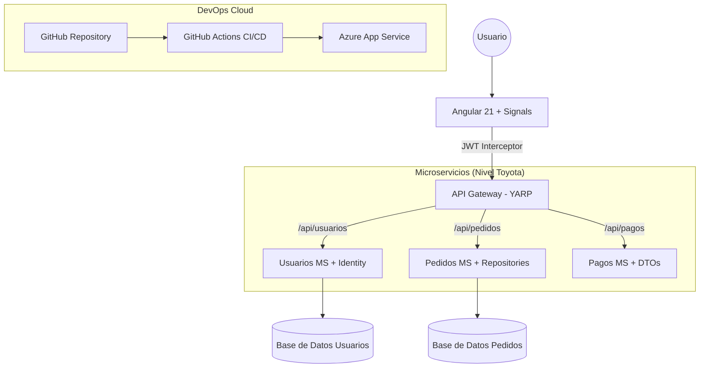

# 🚀 Proyecto Pedidos: Arquitectura Enterprise (Nivel Toyota)

[](https://github.com/alejandrochreyes2/proyecto-pedidos/actions)

Este proyecto ha evolucionado de un MVP básico a una **Arquitectura Enterprise de alto nivel (Nivel Toyota)**. Implementa un ecosistema de microservicios robusto, seguro y escalable utilizando las últimas tecnologías de .NET y Angular.

---

## 🏗️ Arquitectura del Sistema

El sistema utiliza un patrón de **API Gateway** para centralizar la comunicación y ocultar la complejidad de la infraestructura interna.

### Componentes Principales:
1.  **Frontend (Angular 21)**: Modernizado con **Signals** para gestión de estado reactiva y **Interceptores funcionales** para manejo de JWT.
2.  **API Gateway (YARP)**: Punto de entrada único que enruta el tráfico hacia los microservicios correspondientes.
3.  **Microservicios (.NET 8)**:
    *   **Usuarios**: Gestión de identidad con **ASP.NET Core Identity** y JWT.
    *   **Pedidos**: Lógica de negocio de órdenes con **Repository Pattern**.
    *   **Pagos**: Procesamiento de transacciones.
4.  **Base de Datos**: Persistencia real (configurada con EF Core e Identity).
5.  **DevOps**: Automatización total con **GitHub Actions (CI/CD)**.

---

## 🛣️ Hoja de Ruta: La Evolución "Toyota"

Se implementaron 4 fases críticas para alcanzar este estándar profesional:

### Fase 1: Seguridad de Grado Industrial
- **Autenticación Real**: Integración de `Microsoft.AspNetCore.Identity`.
- **JWT Robusto**: Generación y validación de tokens con Claims y roles dinámicos.
- **Roles en BD**: Control de acceso basado en roles persistidos.

### Fase 2: Arquitectura Limpia
- **Repository Pattern**: Desacoplamiento de la lógica de datos mediante interfaces e implementaciones limpias.
- **DTOs (Data Transfer Objects)**: Contratos claros de entrada y salida para las APIs.
- **AutoMapper**: Mapeo automático de entidades a DTOs para evitar código repetitivo.

### Fase 3: Gateway Centralizado
- **YARP (Yet Another Reverse Proxy)**: Implementación de un Gateway profesional para balanceo y enrutamiento.
- **Single Entry Point**: El frontend solo conoce una URL, simplificando CORS y despliegue.

### Fase 4: Modernización y Cloud
- **Angular Signals**: Gestión de estado de última generación (adiós a los Subject/BehaviorSubject innecesarios).
- **HTTP Interceptors**: Inyección automática de tokens de seguridad.
- **CI/CD**: Pipeline automatizado para compilación y validación de calidad en cada commit.

---

## 📊 Diagrama de Arquitectura Objetivo



---

## 💻 Tecnologías Utilizadas

| Capa | Tecnologías |
|------|-------------|
| **Frontend** | Angular 21, Signals, RxJS, TypeScript, CSS3 Puro |
| **Backend** | .NET 8, ASP.NET Core Identity, Entity Framework Core |
| **Gateway** | YARP Reverse Proxy |
| **Patrones** | Repository Pattern, DTOs, Mapping Profiles, Dependency Injection |
| **Seguridad** | JWT (JSON Web Tokens), OAuth2 Identity |
| **DevOps** | Docker, Docker Compose, GitHub Actions |

---

## 🚀 Cómo Ejecutar el Proyecto

### Localmente con .NET CLI
1. Ejecutar el **ApiGateway**: `dotnet run --project backend/ApiGateway`
2. Ejecutar los microservicios: `Usuarios`, `Pedidos` y `Pagos`.
3. Iniciar el Frontend: `cd frontend && npm start`

### Con Docker Compose
```bash
docker-compose up --build
```

---

## 📁 Estructura del Repositorio
```text
proyecto-pedidos/
├── .github/workflows/      # CI/CD Pipelines
├── backend/
│   ├── ApiGateway/         # Gateway YARP (Fase 3)
│   ├── usuarios/           # Microservicio de Identidad (Fase 1)
│   ├── pedidos/            # Microservicio de Negocio
│   └── pagos/              # Microservicio de Procesamiento
├── frontend/               # Angular 21 (Fase 4: Signals + Interceptors)
├── arquitectura/           # Documentación técnica
└── docker-compose.yml      # Orquestación de contenedores
```

---

Desarrollado con ❤️ para alcanzar el **Nivel Toyota** en arquitectura de software. 🏁🚀
